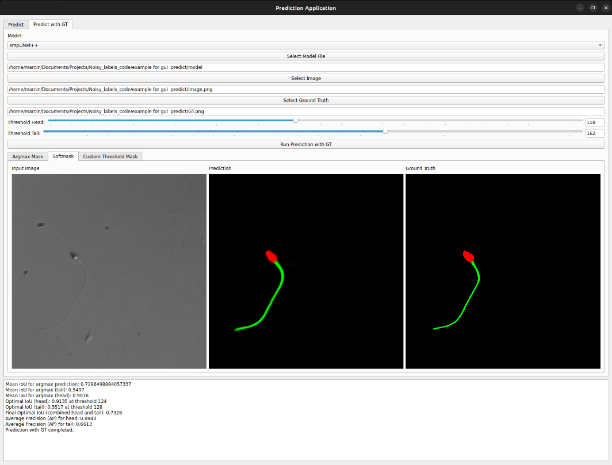

# Projekt Segmentacji Plemników oparty o Pracę Magisterską: "Uczenie w przypadku niepewnej wiedzy eksperckiej przejawiającej się poprzez zaszumione etykiety w aplikacji segmentacji obrazów medycznych"

Ten projekt stanowi rozwiązanie do segmentacji obrazów plemników z uwzględnieniem problemu zaszumionych etykiet. Projekt wykorzystuje bibliotekę PyTorch i oferuje zarówno funkcjonalności trenowania modeli, jak i inferencji z dynamicznym dostosowaniem parametrów.

# O pracy magisterskiej

Praca magisterska skupia się na problemie zaszumionych etykiet, które powstają na skutek subiektywnych decyzji ekspertów podczas adnotacji obrazów medycznych, w tym obrazów plemników. Celem projektu było opracowanie technik umożliwiających skuteczną segmentację w obecności niepewnych etykiet, co jest szczególnie istotne w przypadku takich procedur medycznych jak docytoplazmatyczna iniekcja plemnika (ICSI). W pracy opracowano narzędzia do łączenia wyników wielu adnotatorów oraz zaawansowane metody augmentacji danych, aby poprawić jakość segmentacji plemników. Segmentacja ta pozwala na zmniejszenie subiektywności oceny adnotatorów.

Jednym z kluczowych elementów tego podejścia było zastosowanie zaawansowanych metod augmentacji. Rysunek poniżej przedstawia zestawienie realnych przypadków z danymi, które zostały zasymulowane przy użyciu opracowanej augmentacji:


*Rysunek: Zestawienie realnych przypadków do symulowanych przez augmentację.*

W celu lepszego zobrazowania podejścia augmentacyjnego, poniżej przedstawiono schemat budowy modułu augmentacji:


*Rysunek: Schemat budowy modułu augmentacji.*

Końcowe wyniki segmentacji porównujące model wytrenowany z dedykowaną augmentacją oraz końcowy model z pracy magisterskiej można zobaczyć poniżej. Ilustrują one różnice w jakości wyników segmentacji:


*Rysunek: Przykłady wyników jakościowych porównujących dwa modele*


## Struktura projektu

- **data.py** - moduł odpowiedzialny za przetwarzanie danych oraz ładowanie obrazów i masek.
- **train.py** - skrypt do trenowania modelu z różnymi konfiguracjami i parametrami.
- **inference.py** - moduł do przeprowadzania inferencji na nowych danych.
- **metrics.py** - moduł obliczający metryki, takie jak IoU (Intersection over Union) i Average Precision (AP).
- **basic_augmentation.py** oraz **class_specific_augmentation.py** - moduły zawierające augmentacje stosowane podczas treningu.
- **gui.py** - plik odpowiedzialny za graficzny interfejs użytkownika (GUI) do trenowania modeli i inferencji.
- **gui_predict.py** - GUI do przeprowadzania predykcji z dynamicznym ustawianiem progów i obsługą danych referencyjnych (ground truth).

### Interfejs użytkownika

Poniżej przedstawiono interfejsy użytkownika dla trybu treningu oraz inferencji, które zostały zaimplementowane w projekcie:


*Rysunek: Porównanie interfejsów użytkownika dla trybu treningu i inferencji.*

Dodatkowo, poniżej przedstawiono aplikację do wizualizacji wyników segmentacji oraz oceny jakości predykcji:



*Rysunek: Aplikacja wizualizacji wyników segmentacji oraz oceny jakości predykcji.*


## Sposób użycia

### Trenowanie modelu

Aby wytrenować model, należy użyć pliku train.py. Skrypt umożliwia konfigurację parametrów treningu za pomocą argumentów wiersza poleceń, takich jak liczba epok, model, funkcja straty oraz tryb augmentacji. Przykładowa komenda:

```bash
python train.py --epochs 300 --batch_size 6 --lr 0.001 --annotator 1 --model smpUNet++ --augmentation --loss CrossEntropyLoss --optimizer Adam --scheduler CosineAnnealingLR --place lab --mode two_task_training(4) --k 5
```

### Inferencja

Aby przeprowadzić inferencję, użyj skryptu inference.py, który wczytuje wytrenowany model oraz dane wejściowe na podstawie konfiguracji określonej w pliku config.yaml. Przykładowa komenda:
```bash
python inference.py --model model.pth --batch_size 1 --mode two_task_training(4) --annotator 1
```

### Kluczowe Moduły

- data.py: Przetwarza dane wejściowe, tworzy tensory z obrazów oraz odpowiednio formatuje maski. Obsługuje różne tryby agregacji etykiet, w tym mean voting, majority voting oraz intersection.
- metrics.py: Moduł oblicza kluczowe metryki oceniające jakość segmentacji: 
  - IoU (Intersection over Union): Mierzy dokładność segmentacji, porównując część wspólną i sumę przewidywanych oraz rzeczywistych masek.
  - AP (Average Precision): Miara uwzględniająca precyzję i czułość modelu.
- basic_augmentation.py oraz class_specific_augmentation.py: Zawierają klasyczne i specyficzne augmentacje stosowane podczas treningu.
- gui.py: Plik odpowiedzialny za graficzny interfejs użytkownika (GUI) do trenowania modeli oraz inferencji.
- gui_predict.py: Plik GUI do przeprowadzania predykcji z dynamicznym ustawianiem progów oraz obsługą danych referencyjnych (ground truth).

### Modele

- DualUNetPlusPlus: Model definiowany w pliku DualUNetPlusPlus.py, składający się z dwóch sieci UNet++. Model działa w dwóch etapach: pierwszy UNet++ przetwarza dane wejściowe, a jego wyniki są łączone z oryginalnymi danymi wejściowymi i przekazywane do drugiego UNet++, który generuje ostateczne wyniki segmentacji.

### Wymagania systemowe

- Python 3.8 lub nowszy.
- Biblioteki zewnętrzne:
  - opencv-python
  - torch
  - torchvision
  - numpy
  - matplotlib
  - wandb
  - scikit-learn
  - Pillow
  - PyQt5
  - segmentation-models-pytorch
  - pandas
  - kornia
  - numba
  - natsort
  - scipy

Wszystkie te biblioteki można zainstalować za pomocą poniższej komendy:

```bash
pip install opencv-python torch torchvision numpy matplotlib wandb scikit-learn Pillow PyQt5 segmentation-models-pytorch pandas kornia numba natsort scipy
```


